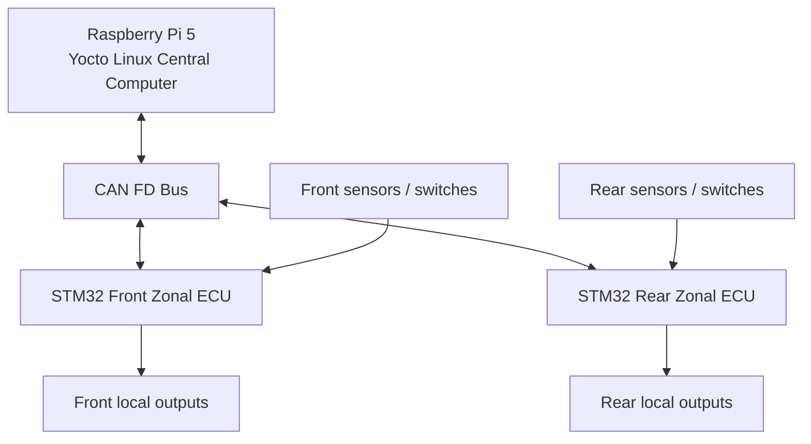
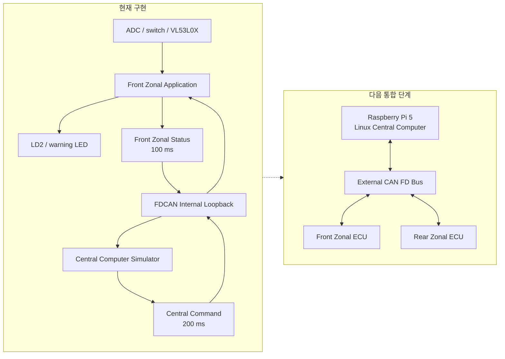

# Automotive Zonal ECU Prototype

Raspberry Pi 5 기반 **Central Computer**와 두 개의 STM32 기반 **Front / Rear Zonal ECU**를 CAN FD로 연결하는 차량 E/E 아키텍처 축소 프로젝트입니다.

각 Zonal ECU는 자신의 영역에 연결된 센서와 출력 장치를 직접 관리하고, Central Computer는 차량 모드와 상위 제어 정책, 전체 ECU 상태 감시, 로깅 및 진단을 담당합니다.

현재 저장소에는 **NUCLEO-G474RE에서 검증한 Front Zonal ECU superloop baseline**이 구현되어 있습니다. 이후 동일한 firmware architecture를 기반으로 Rear Zonal ECU를 추가하고, Raspberry Pi 5와 실제 CAN FD bus를 통합할 예정입니다.

## Current milestone

`v0.1 — Front Zonal ECU superloop baseline`

현재 구현하고 실제 보드에서 검증한 범위는 다음과 같습니다.

* STM32G474 170 MHz system clock
* ADC 기반 analog input 처리와 0~1000 permille 변환
* 20 ms switch debounce
* VL53L0X non-blocking 거리 측정 서비스
* CAN FD frame encode/decode와 payload validation
* FDCAN internal loopback 및 interrupt 기반 RX
* 100 ms 주기의 Front Zonal Status 전송
* Central Computer Simulator의 200 ms command 전송
* command timeout 발생 시 output 차단 및 `SAFE` 상태 전환
* 거리 센서 오류 발생 시 `DEGRADED` 상태 전환
* CAN sequence, invalid payload, HAL TX failure, timeout 진단 카운터
* 하드웨어 비의존 모듈의 host unit test
* 실제 보드 기반 regression test

현재 단계에서는 Front Zonal ECU 내부에 Central Computer Simulator를 함께 실행해 양방향 CAN 통신, 상태 전이, command timeout과 fault handling을 검증합니다.

## Target system



최종적으로는 하나의 Central Computer가 Front / Rear Zonal ECU를 통합 관리하는 구조를 목표로 합니다.

Central Computer는 차량 모드와 상위 제어 명령을 생성하고, 각 Zonal ECU는 자신의 영역에서 필요한 입력 처리와 local control을 독립적으로 수행합니다.

## Development status



현재 Central Computer Simulator는 Raspberry Pi가 연결되기 전까지 CAN contract와 ECU application 동작을 독립적으로 검증하기 위한 임시 구성입니다.

외부 CAN FD 통합 이후에는 simulator를 제거하고 Raspberry Pi의 Linux service가 실제 command를 전송합니다.

## Responsibility split

| Component        | Responsibility                                                                               |
| ---------------- | -------------------------------------------------------------------------------------------- |
| Central Computer | vehicle mode 관리, 상위 제어 정책, command 생성, ECU 상태 수집, heartbeat 감시, logging 및 diagnostics        |
| Front Zonal ECU  | 전방 영역의 sensor 및 switch 입력, local output 제어, 주기 상태 전송, command timeout 기반 safe output         |
| Rear Zonal ECU   | 후방 영역의 sensor 및 switch 입력, local output 제어, 주기 상태 전송, command timeout 기반 safe output         |
| CAN contract     | sender/receiver, CAN ID, payload format, cycle time, alive counter, validity 및 timeout 규칙 정의 |

## ECU concept

### Front Zonal ECU

Front Zonal ECU는 차량 전방 영역에 연결된 입력과 출력을 담당합니다.

현재 baseline에서는 다음 기능을 구현합니다.

* analog input
* switch input
* front distance sensor
* warning output
* periodic status transmission
* command timeout detection
* sensor fault detection
* `NORMAL`, `DEGRADED`, `SAFE` 상태 전이

### Rear Zonal ECU

Rear Zonal ECU는 Front Zonal ECU에서 검증한 공통 architecture를 재사용해 개발할 예정입니다.

예정된 역할은 다음과 같습니다.

* rear distance sensor
* rear switch input
* reverse warning output
* rear lighting output
* periodic status transmission
* command timeout detection
* sensor 및 communication fault handling

Rear Zonal ECU는 Front firmware를 단순 복사하는 방식이 아니라, 공통 service와 protocol layer를 재사용하고 ECU별 application 및 hardware configuration을 분리하는 방향으로 설계합니다.

### Central Computer

Central Computer는 Raspberry Pi 5에서 동작하는 Linux 기반 상위 제어기입니다.

예정된 주요 기능은 다음과 같습니다.

* vehicle mode 관리
* Front / Rear Zonal ECU command 생성
* ECU status 및 heartbeat 감시
* communication timeout 검출
* degraded operation 관리
* CAN message logging
* fault event 및 diagnostic data 저장
* Linux service 자동 시작 및 복구
* SocketCAN 기반 CAN FD communication

최종 단계에서는 Device Tree와 Yocto를 이용해 프로젝트 전용 Linux image를 구성할 예정입니다.

## Multi-ECU fault scenario

두 개의 Zonal ECU를 구성하는 목적은 단순히 STM32 보드 수를 늘리는 것이 아니라, 다중 ECU 환경에서 발생하는 통신과 fault handling을 검증하는 것입니다.

대표적인 목표 시나리오는 다음과 같습니다.

```text
Rear Zonal ECU heartbeat timeout
→ Central Computer가 REAR_ZONE_LOST fault 검출
→ Rear 관련 command 전송 중단
→ Rear output을 safe state로 전환
→ Front Zonal ECU 기능은 계속 유지
→ Central Computer가 degraded operation 기록
```

이를 통해 한 ECU의 장애가 전체 시스템 정지로 이어지지 않도록 역할 분리, 장애 감지, 기능 격리와 상태 복구를 검증합니다.

## Repository layout

```text
automotive-zonal-ecu/
├── README.md
├── .gitignore
├── docs/
│   ├── architecture.md
│   ├── requirements.md
│   ├── hardware-setup.md
│   ├── can-protocol.md
│   ├── verification.md
│   └── development-log.md
└── firmware/
    └── front-zonal-ecu/
        ├── App/          # 직접 설계한 application 및 service 코드
        ├── Inc/          # CubeMX generated header
        ├── Src/          # CubeMX generated code와 main integration
        ├── Drivers/      # STM32 HAL, CMSIS, VL53L0X API
        ├── Startup/      # MCU startup assembly
        └── Tests/        # host unit test
```

Rear Zonal ECU와 Raspberry Pi 구현은 실제 코드 개발을 시작하는 시점에 다음 구조로 확장합니다.

```text
automotive-zonal-ecu/
├── central-computer/
├── firmware/
│   ├── common/
│   ├── front-zonal-ecu/
│   └── rear-zonal-ecu/
└── platform/
    └── yocto/
```

최종 directory 구조는 공통 firmware module의 재사용 범위와 Yocto integration 방식에 따라 조정할 수 있습니다.

## Firmware modules

| Module                    | Role                                                |
| ------------------------- | --------------------------------------------------- |
| `can_protocol`            | CAN payload encode/decode와 값 범위 검증                  |
| `can_service`             | FDCAN 초기화, 주기 송신, interrupt RX와 통신 진단               |
| `central_sim`             | Raspberry Pi 통합 전 Central Computer command 생성       |
| `front_zonal_app`         | Front ECU 상태 전이, command timeout과 output policy     |
| `input_service`           | ADC 변환, input validity와 switch debounce             |
| `input_service_stm32`     | HAL ADC/GPIO hardware adapter                       |
| `distance_sensor_service` | VL53L0X 초기화와 non-blocking measurement state machine |
| `time_utils`              | tick rollover와 interrupt context를 고려한 경과 시간 계산      |

Rear Zonal ECU 개발 단계에서는 CAN, time, diagnostics와 hardware-independent input module을 공통 layer로 분리하고, ECU별 application과 hardware adapter를 별도로 구성할 예정입니다.

## Documentation

상세 설계와 검증 기록은 `docs/`에서 관리합니다.

* [Architecture](docs/architecture.md)
* [Requirements](docs/requirements.md)
* [Hardware setup](docs/hardware-setup.md)
* [CAN protocol](docs/can-protocol.md)
* [Verification](docs/verification.md)
* [Development log](docs/development-log.md)

## Build

### STM32 firmware

1. STM32CubeIDE에서 `firmware/front-zonal-ecu`를 existing project로 import합니다.
2. `Debug` configuration을 선택합니다.
3. Project의 Clean과 Build를 실행합니다.
4. ST-LINK를 통해 NUCLEO-G474RE에 firmware를 다운로드합니다.

현재 기준 전체 ARM build 결과는 다음과 같습니다.

```text
0 errors, 0 warnings
```

### Host unit tests

`Tests/`는 HAL에 의존하지 않는 firmware module을 PC C compiler에서 검증합니다.

현재 검증 대상은 다음과 같습니다.

* CAN protocol
* Central Computer Simulator
* Front Zonal Application
* Input Service
* time utility

반복 실행용 test script와 CI pipeline은 후속 단계에서 추가합니다.

## Roadmap

* [x] STM32 peripheral and sensor bring-up
* [x] Front Zonal ECU superloop baseline
* [x] CAN FD internal loopback and interrupt RX
* [x] Protocol, service, application modularization
* [x] Host unit tests and board regression test
* [ ] FreeRTOS task architecture
* [ ] TJA1051T/3 external CAN FD transceiver integration
* [ ] Front Zonal ECU external CAN FD communication
* [ ] Common firmware layer 분리
* [ ] Rear Zonal ECU firmware 구현
* [ ] Raspberry Pi MCP2518FD and SocketCAN integration
* [ ] Real three-node CAN FD communication
* [ ] ECU heartbeat 및 communication timeout monitoring
* [ ] Multi-ECU fault isolation and degraded operation
* [ ] Linux service lifecycle, logging and diagnostics
* [ ] Device Tree integration
* [ ] Yocto image integration

## Engineering boundary

이 저장소는 automotive-style E/E architecture와 embedded software development process를 학습하고 검증하기 위한 prototype입니다.

다음 항목의 준수를 주장하지 않습니다.

* AUTOSAR compliance
* ISO 26262 compliance
* ASIL qualification
* production-ready automotive ECU
* production vehicle network security

대신 명확한 responsibility split, CAN contract, timeout 처리, fault state, modular firmware, host test와 hardware verification을 통해 차량 ECU software architecture의 핵심 개념을 단계적으로 구현하는 것을 목표로 합니다.
